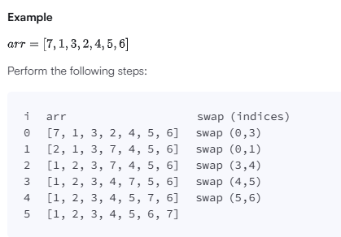

# Minimum Swaps 2 - Personal Notes

## Problem Description

Given an unordered array consisting of consecutive integers without any duplicates.

I am allowed to swap any two elements.

I am supposed to find the min number of swaps required to sort the array in **ascending** order.

### Example

** *

## Solution approach

One could use the greedy approach with the concept of cycle decomposition.

