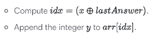
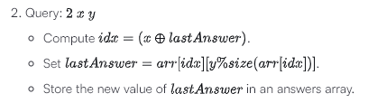
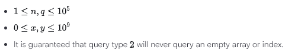

# Dynamic Array

url: <https://www.hackerrank.com/challenges/dynamic-array/problem?isFullScreen=true>

## Description

Declare a 2-dimensional array, `arr`, with  empty arrays, all zero-indexed.
Declare an integer,`lastAnswer` , and initialize it to 0.

You need to process two types of queries:

- 
- 

## Notes

-  is the bitwise XOR operation, which corresponds to the ^ operator in most languages. Learn more about it on Wikipedia.
-  is the modulo operator.
- Finally, `size(arr[idx])`  is the number of elements in `arr[idx]`.

## Function description

Complete the `dynamicArray` function with the following parameters:
- `int n` : the number of empty arrays to initialize in `arr`
- `int queries[q][3]: 2-D array of integers

Returns

: `int[]`:the results of each type 2 query in the order they are presented

Input Format

The first line contains two space-separated integers, `n` , the size of `arr` to create, and `q`, the number of queries, respectively.
Each of the `q` subsequent lines contains a query string, `queries[i]`.

Constraints

