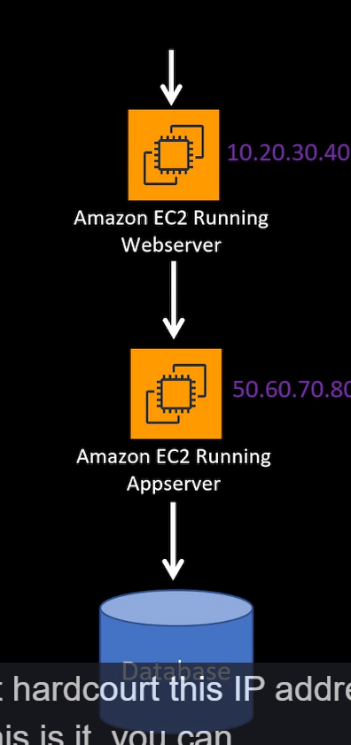
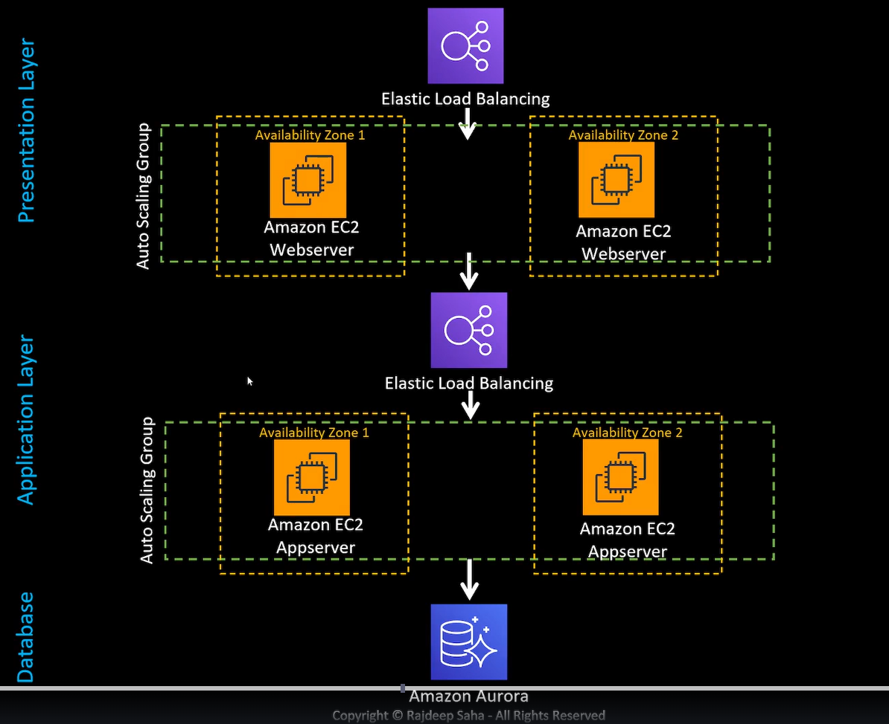

# 3 tiers Architecture

3 main layers

- Presentation Layer (Frontend)
- Application Layer (Backend)
- Database

## Presentation Layer

- Running on ngnex or Apache
- User clicks something and triggers application layer business logic

## Application Layer

## Database

## General solution

