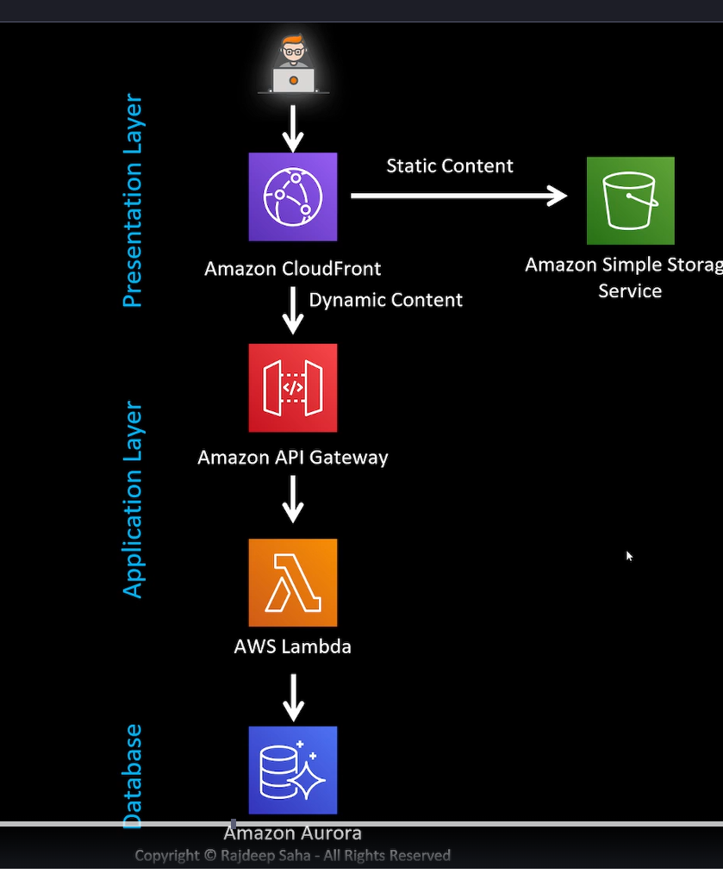
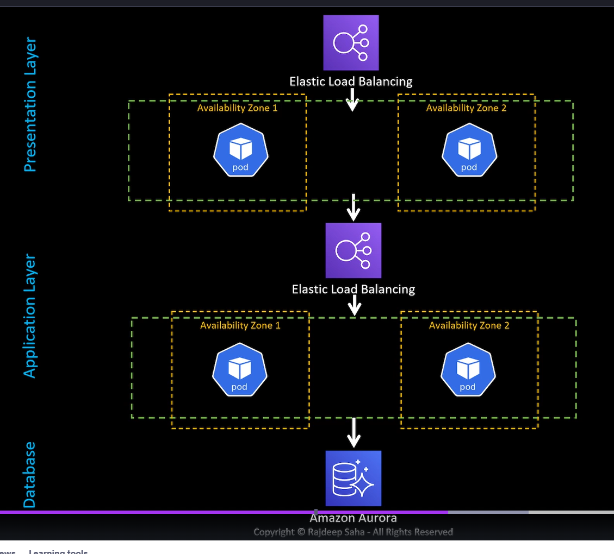
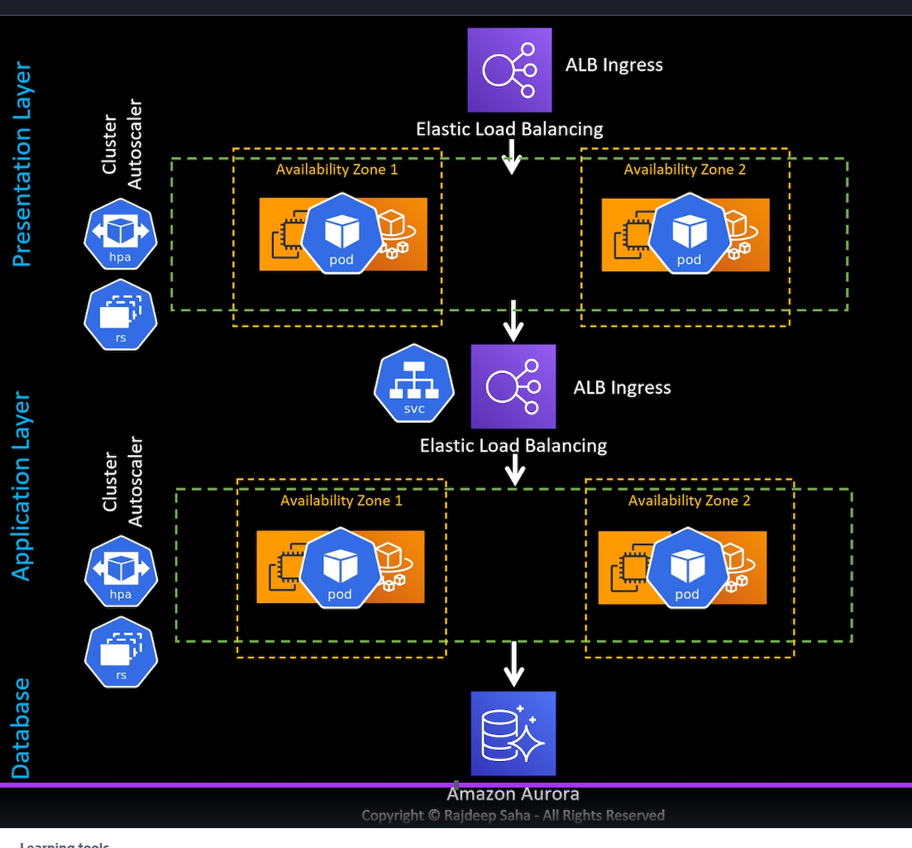

# Three-Tier Architecture with Serverless

- Static content is stored on an amazon bucket
- Dynamic content is dealt by API gateway
- Business logic is on AWS Lambda

## Serverless Design

- We dont have to worry about scalability and HA. This is done automatically.

## 3-tier with Kubernetes

At least 2 pods on different zones.

- Cluster autoscaler
- Load balancer Ingress
- Pods are stateless

