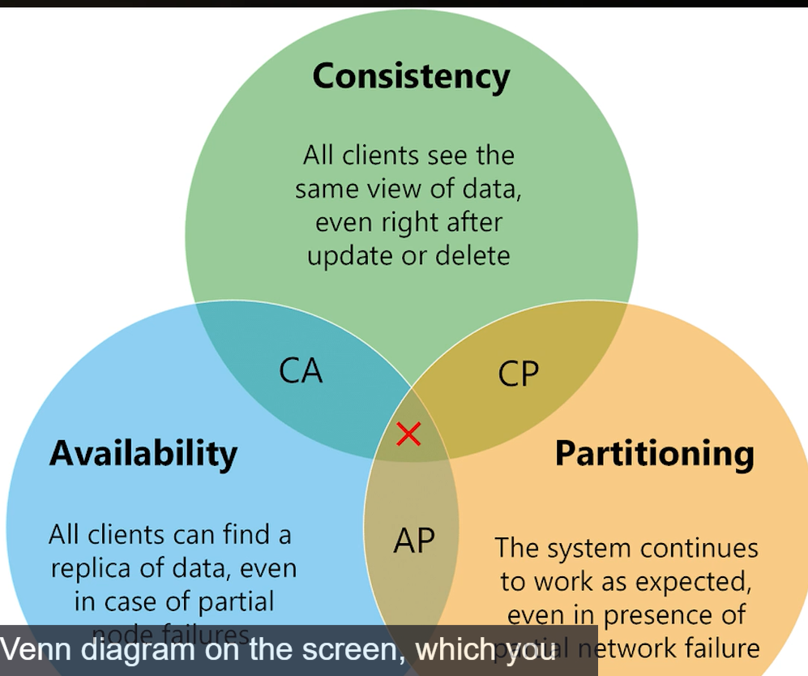

# CAP

NoSQL databases follow CAP theorem, not ACID.

C = consistency
A = Availability
P = Partitioning

On a distributed system, you can only achieve two of 3 letters.

Partition tolerant does not mean you are reading the correct data, it means system still able to work on a fault.

AC is not possible on distributed systems, Eventually, one node will go down.

On the banking area, High consistency is more important than availability. If you go to a terminal and check your 
balance and then go to another terminal, and there is a disconnection, because it is using consistency, it will not show
your current balance.

On social networks, availability is prefered agains consistency. For example, facebook like counter could be wrong for a
certain period of time due to a fault, but application still working. After a period, likes counter updates and shows the
correct value.

