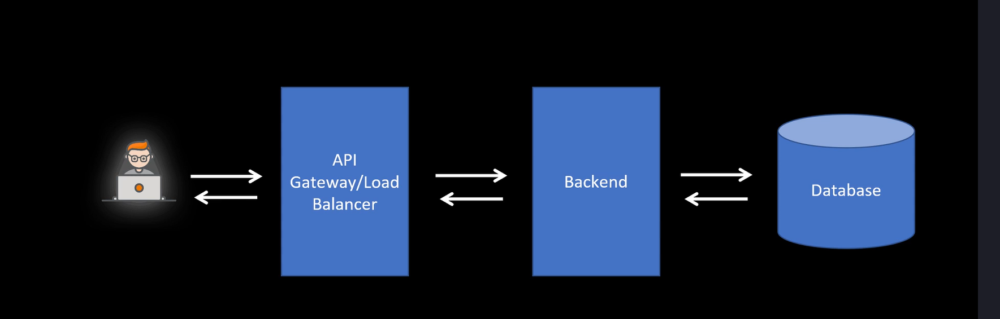
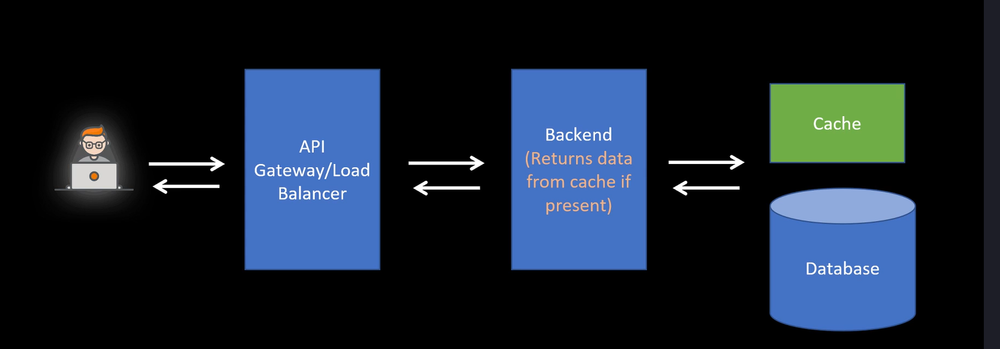
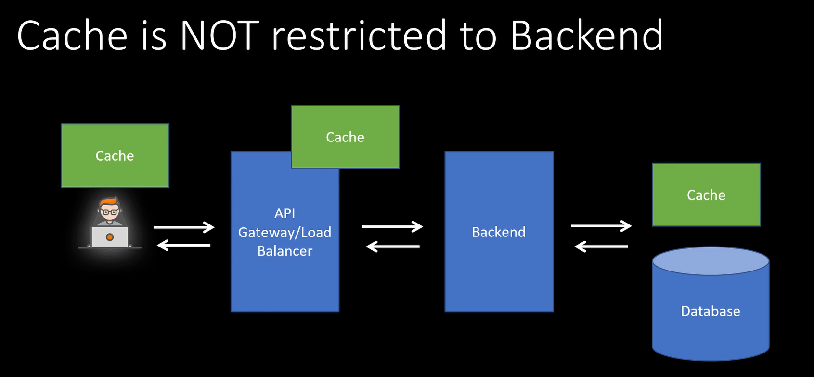
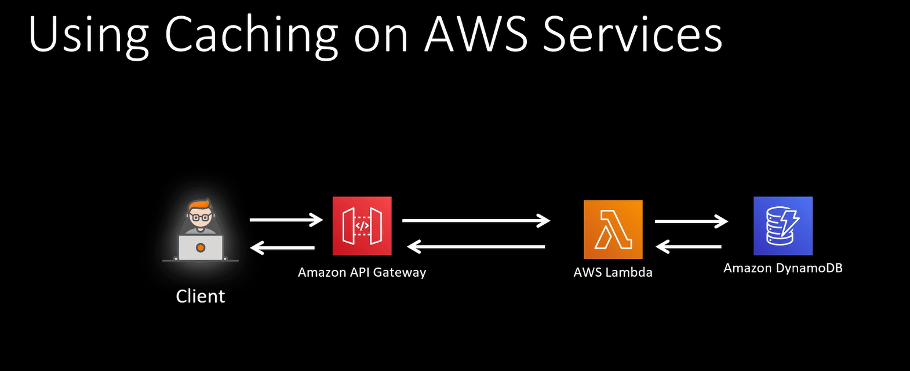

# Caching mechanism

## Why?

Backend runs complex queries, taking capacity from DBs. DBs are slower to responde, usually are on disk.

Cache install a subset of DB on memory, which is much faster.

Now, backend checks cache first for the data. If data is not found on cache, then checks database.

## Cache Deletion

- Cache entries deleted after a specified time
- TTL
- Cache entries can be updated with backend code
- Cache is just another database, smaller and faster on your system

## Different types os caching

- Use managed caching of the service, API gateway caching
- If service doesn´t provide caching

Traditional system design
