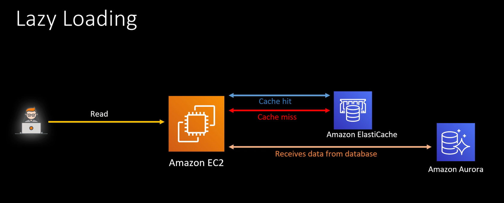

# Redis and Caching strategies

Redis is a database that can be used for caching. It has optimizations for faster indexing.

## Lazy Loading

Key principles are:

- Cache hit
- Cache Miss

Data only gets loaded during read. 

## Write-through

During Write to the database, anytime, it does the same to the cache.

Data in Cache is never staled.

Write take a little bit longer, because is writing on dabase and also on the cache.

## Which one to choose?

There is a no correct answer, it depends on your application. Sometimes, a mix of both strategies.