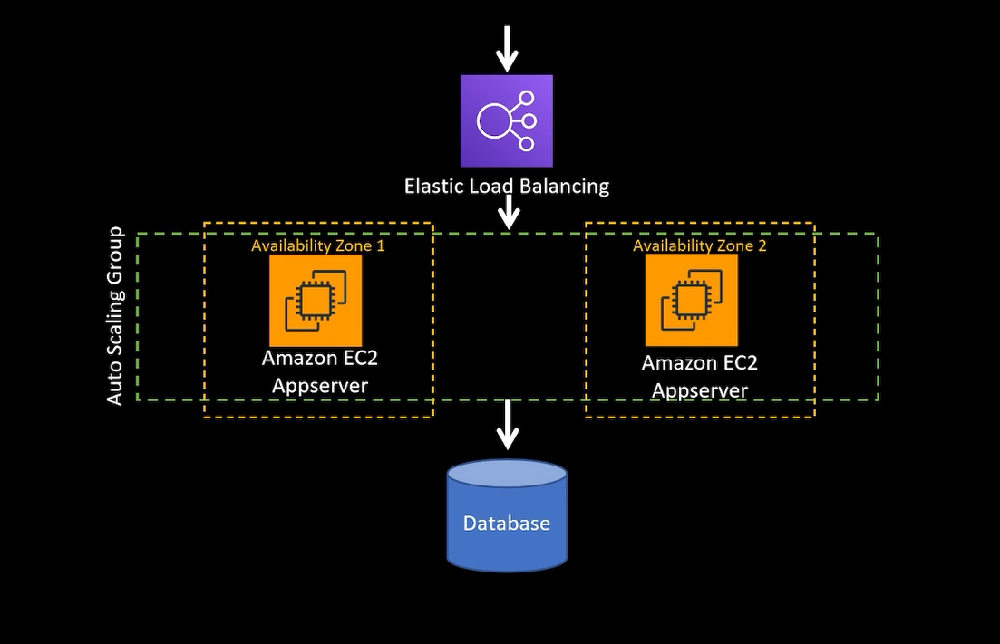
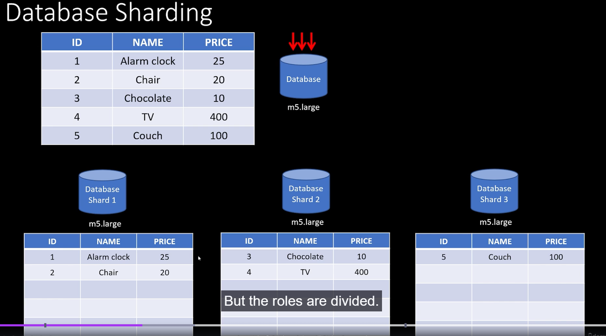
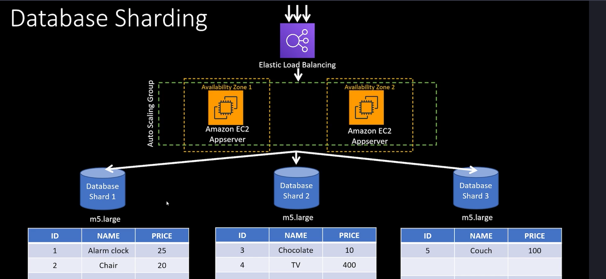

# Database Sharding

Also know as Horizontal partitioning.

Initial Scenario:

If traffic scales on this application, load balancing will handle EC2. At one point, database will overload.

During this traffic peak, it is not viable to do a vertical scale on the database, since it would need to be shutdown
for a while until new hardware is ready.

Now, we are sharding this original large database into 3 databases, and split those rows into those 3 new dbs.

Depending on the ID, Application is able to foward data into different shards.

Hashing algorithm is a tool to select each one of the shards.

## Advantages

- Scaling horizontally supports distributed computing
- Faster query response times
- Limited blast radius during outage

Queries on a monolith database, queries might be slow because they have to search the hole database for a match.

## Disadvantages

- Unbalanced shards
- Re-sharding is painful, because you have to rebalance shards to avoid a shard overload
- Implementing a sharding logic is complex
