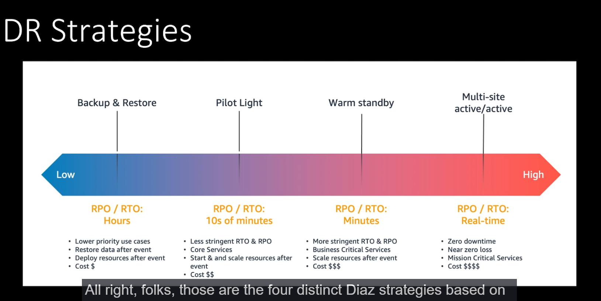

# Disaster Recovery

Basically, Amazon offers multiple options according to your budget and application requirements.

The most expensive disaster recovery solution is a full replica of your application, running on max, on another region.