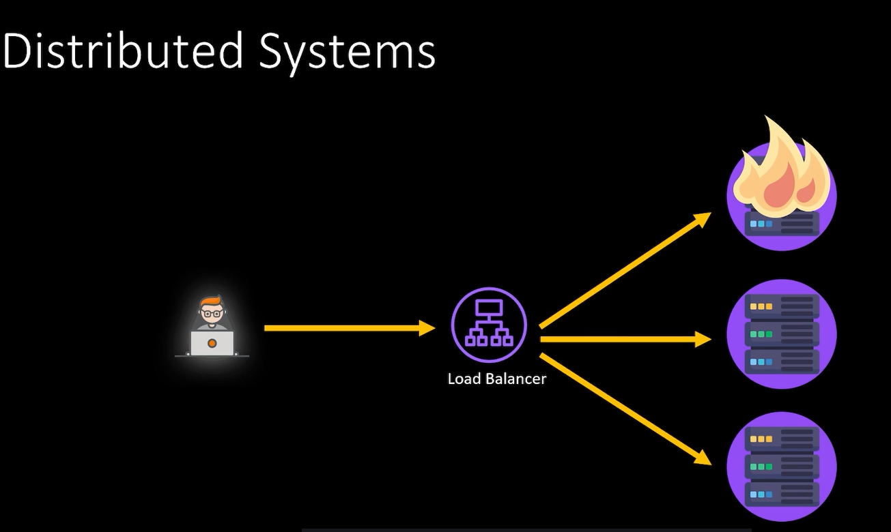

# Distributed Computing

If I am running my application locally, it means I have a centralized system. If my local fails, Application if off.

Distributed computing means that your application is distributed on many servers.

Scale out horizontally

There is no single point of failure.

Modern systems are distributed.

