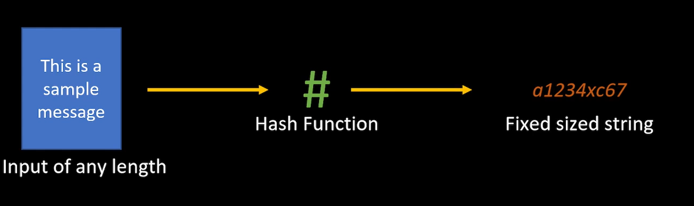

# Hashing

Process of feeding a message of any lenght into a function that creates the an unique output.

On real designs, tables needs to be scalable.

Same input will always output the same value.

We can hash basically everything.

## Consistent Hashing

There is a Hash ring, that helps and improve the traditional method on re-mapping load to the servers.

