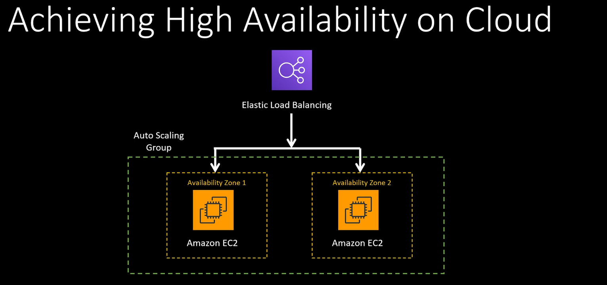
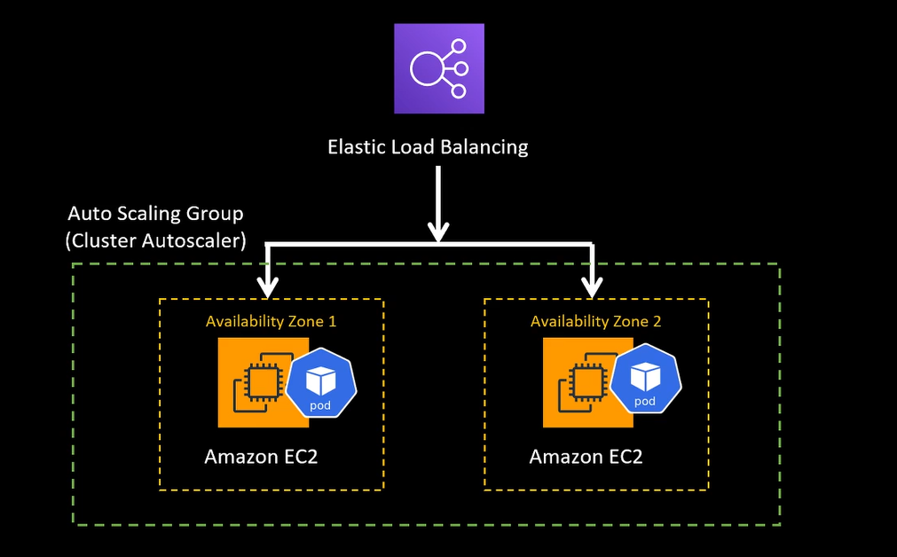

# High Availability

As a system architect, we have to find a way to assure our system is always available. Even when some parts are failing,
we must ensure fallbacks and backups are working to maintain everything as expected.

## Identifying single point of failure

- Server running your applications
- Databases
- Load Balancer
- Check each system component and validate

## HA on cloud (AWS)

Generally, load balancer is a single point of failure.

On cloud, it has HA, managed by cloud provider.

Applications hosted on different availability zones ensure HA. Even if one zone goes down, other zones are still good.

Another solution with containers, kubernetes pods hosted on EC2 VMs from different zones.

