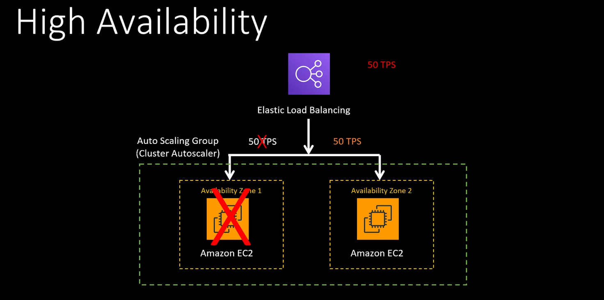

# HA vs Fault Tolerance

Even if one part of my application goes down, system still able to serve users. This is HA.

The system above is HA, but for a moment, while another VM is spinning up, system is working on 50 TPS.

The thing is, system requires 100 TPS, even if 1 zone goes down.

Fault tolerance system needs to be prepared for this requirement, which means spinning up more containers on other zones.

Fault Tolerance systems are usually more expensive than HA systems.