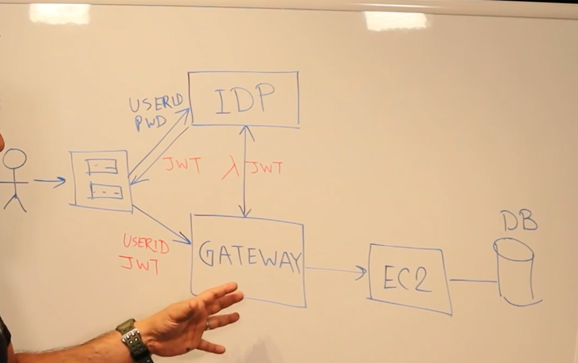

# Authentication and Authorization

User ID and password is authentication to login.

Authorization is "what" can you do when logged in.

## IDP

Identity provider

- Active director

## Auth flow

- Frontend screen with a form that asks for id and password
- Sends information to the IDP if user matches
- IDP responds with a token (JWT)
- After token response, application can use API routes with userID and token
- During an API usage, API will check with IDP with token is valid or not, and keep connection or close it
- Between API and IDP, there could be a lambda function to check for authorization
- This lambda function or EC2 between IDP and API could have a caching mechanism to speed up connections

## Diagram

