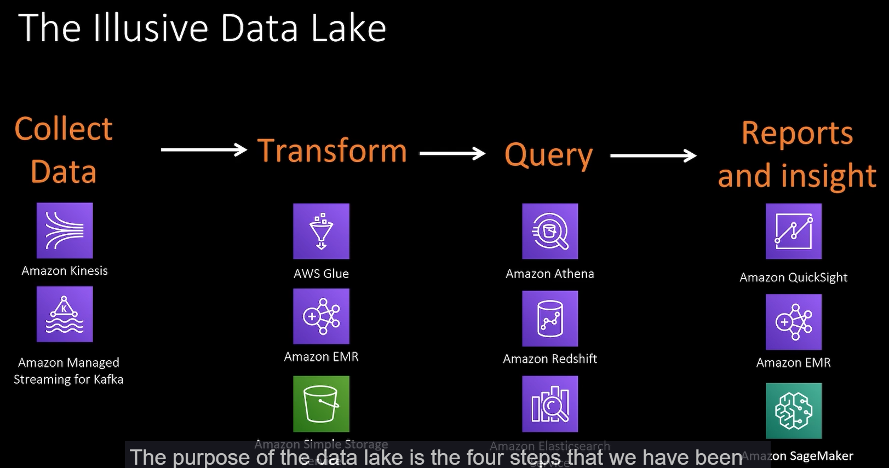

# Data Analytics System Design

## Sample Architecture

### Query and report on click stream

Key point: 

- AWS Glue
- Amazon Athena

### ETL and data Warehouse

key points:

### Unified catalog across multiple data stores

## AWS Glue

- serverless data integration tool
- it will scale as needed and paid on demand
- Glue crawlers can run o data and create metadata
- Visually create ETL flow
- Enrich, clean and normalize data without writing code

## Data Lake

- Collect Data
- Transform
- Query
- Reports and insight

Data lake holds massive amount of data.