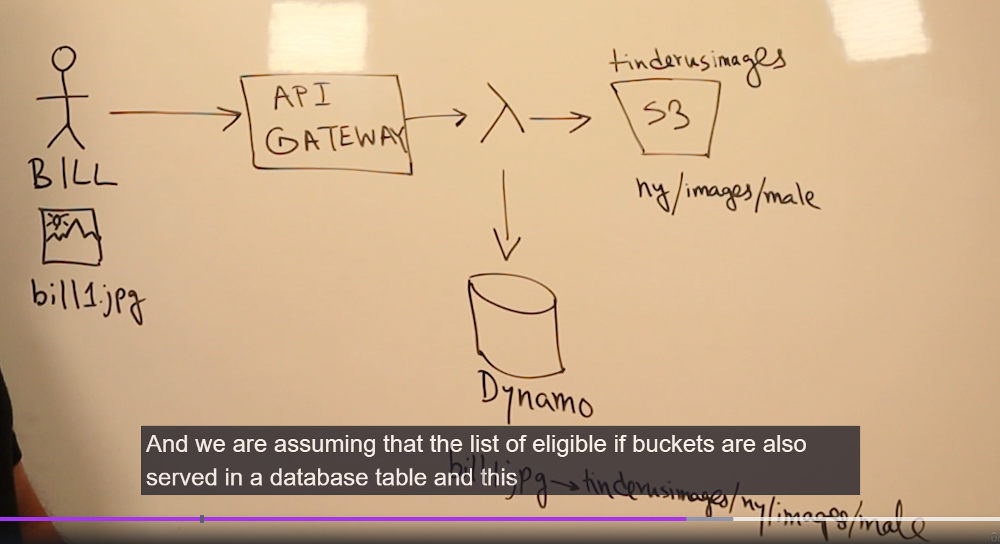
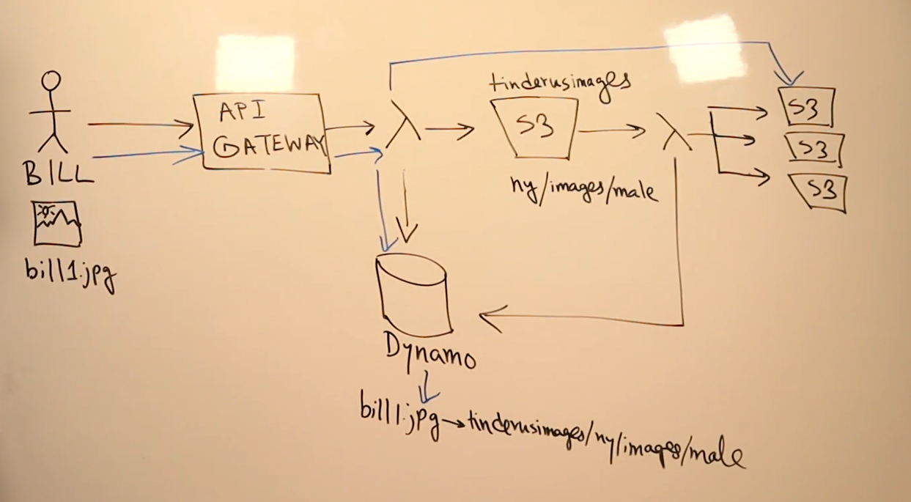

# Storage and Retrieve Images

It is not just saving and retrieving. 

We have to consider different formats of image in order to offer different options for different consumers (devices).

- Down scale logic

The second consideration is cost. Taking care of costs is crucial for a smooth application maintenance on the long run.

Examples:

- S3-inteligent-tearing
- S3 auto-scalable

## Design

Working with layers.

