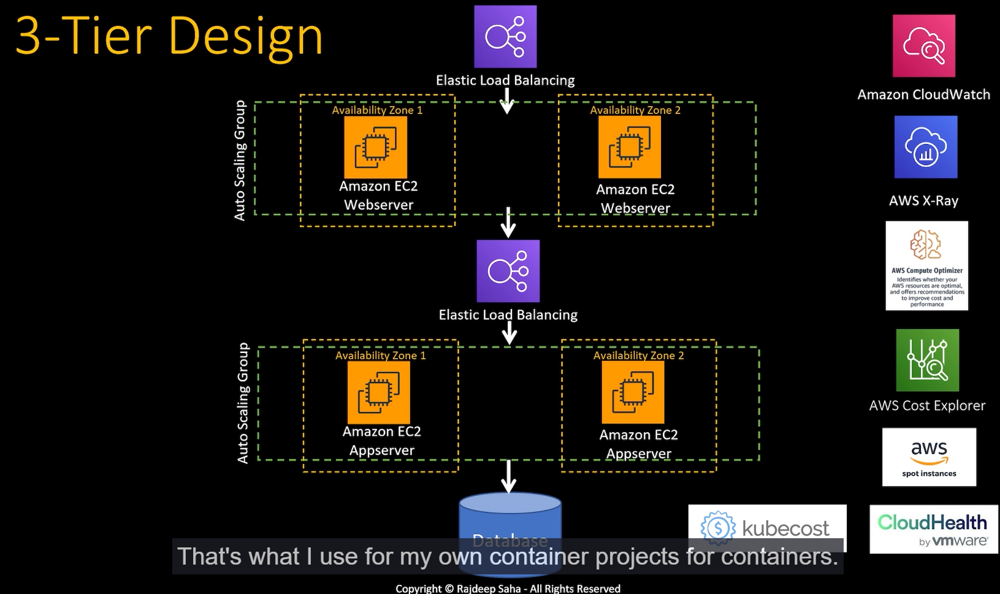

# Performance and Cost Optimization

Tackling strategy to solve any Tuning/Troubleshooting:

- Monitor: logs, metrics, traces
- Measure: Define KPI, send alarms
- Remediate: configuration, code

Changing code is the most costly and difficult remediate actions one could have.

## REAL world example

Situation: API is failing to respond or app is crashing

Based on the MMR strategy, lets define:

- Monitor: logs, metrics, CPU/memory utilization on cloudWatch, traces
- Measures: Define KPI, Send Alarms , cloudWatch alarm
- Remediate: Configuration, used home grown algorithm/compute optimizer to optimize EC2 capacity, code

On the image above, we have a common 3-tier Design and on the right, several Amazon tools to implement MMR strategy.